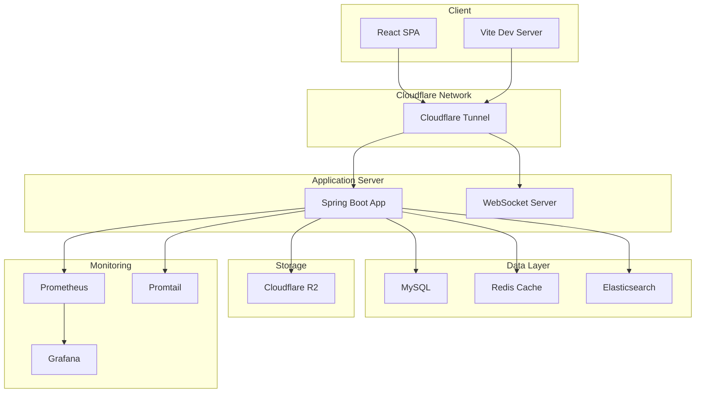

# TalesWiki

<div align="center">
  
  
  <h3>🎮 테일즈위키 - 게임 커뮤니티 위키 플랫폼</h3>
  
  <p>
    <strong>게임 커뮤니티를 위한 협업 위키 시스템</strong><br>
    실시간 채팅, 버전 관리, 고성능 검색을 제공하는 풀스택 웹 애플리케이션
  </p>

  <p>
    <a href="#-주요-기능">주요 기능</a> •
    <a href="#-기술-스택">기술 스택</a> •
    <a href="#-시작하기">시작하기</a> •
    <a href="#-프로젝트-구조">프로젝트 구조</a>
  </p>

  <p>
    
    
    
    
    
    
  </p>
</div>

## 📋 목차

- [개요](#-개요)
- [주요 기능](#-주요-기능)
- [기술 스택](#-기술-스택)
- [아키텍처](#-아키텍처)
- [시작하기](#-시작하기)
- [프로젝트 구조](#-프로젝트-구조)
- [모니터링](#-모니터링)

## 🎯 개요

- 테일즈위키는 게임 커뮤니티를 위한 협업 위키 플랫폼입니다.
- 사용자들이 유저와 길드 정보를 공유하고 관리할 수 있는 공간을 제공합니다.

### 프로젝트 목표

- 🤝 **커뮤니티 주도**: 모든 사용자가 콘텐츠 생성 및 편집 가능
- 📚 **정보 체계화**: 유저와 길드 정보를 체계적으로 관리
- 🔄 **버전 관리**: 모든 수정 내역 추적
- 💬 **실시간 소통**: WebSocket 기반 실시간 채팅
- 🔍 **강력한 검색**: Elasticsearch를 활용한 고성능 검색

## ✨ 주요 기능

### 1. 📖 위키 시스템
- **카테고리 관리**: 런너, 길드 분류
- **버전 관리**: 모든 수정 이력 추적
- **리치 텍스트 에디터**: Toast UI Editor 기반 WYSIWYG
- **이미지 업로드**: R2 저장소 & WebP 자동 변환

### 2. 🔍 검색 시스템
- **전문 검색**: Elasticsearch 기반 한글 검색
- **초성 검색**: 문서 제목 기반 초성 검색
- **인기/랜덤**: 조회수 기반 인기 콘텐츠

### 3. 💬 실시간 채팅
- **익명 채팅**: 자동 생성 닉네임
- **WebSocket**: STOMP 프로토콜 기반
- **채팅 기록**: 메시지 영구 보존
- **세션 관리**: 세션별 사용자 구분

### 4. 🛡️ 관리 시스템
- **콘텐츠 관리**: 사전 문서 삭제/조회
- **사용자 관리**: IP 기반 차단 시스템
- **통계 대시보드**: 사용 통계 및 로그
- **보안**: 관리자 인증 및 권한 관리

### 5. 📊 모니터링
- **메트릭 수집**: Prometheus & Grafana
- **로그 관리**: Promtail & Loki
- **헬스 체크**: Spring Actuator
- **알림**: 임계값 기반 알림

## 🛠 기술 스택

### Frontend
<p>
  
  
  
  
</p>

### Backend
<p>
  
  
  
</p>

### Database & Storage
<p>
  
  
  
  
</p>

### DevOps & Monitoring
<p>
  
  
  
  
</p>

## 🏗 아키텍처

### 시스템 아키텍처



### 소프트웨어 아키텍처

프로젝트는 **Domain-Driven Design (DDD)** 원칙을 따르는 **레이어드 아키텍처**를 채택했습니다:

```
┌─────────────────────────────────────────┐
│          Presentation Layer             │  ← REST Controllers, WebSocket Handlers
├─────────────────────────────────────────┤
│          Application Layer              │  ← Use Cases, Transaction Management
├─────────────────────────────────────────┤
│            Domain Layer                 │  ← Entities, Value Objects, Domain Services
├─────────────────────────────────────────┤
│         Infrastructure Layer            │  ← Repositories, External Services
└─────────────────────────────────────────┘
```

## 🚀 시작하기

### 필수 요구사항

- **Node.js** 20.14.0 이상
- **Java** 21 이상
- **Docker** & Docker Compose
- **MySQL** 8.0 (Docker로 제공)
- **Redis** 6.0 (Docker로 제공)
- **Elasticsearch** 8.x (Docker로 제공)

### 빠른 시작

#### 1. 저장소 클론

```bash
git clone https://github.com/openmpy/taleswiki.git
cd taleswiki
```

#### 2. 백엔드 실행

```bash
cd ./server

# 인프라 실행 (MySQL, Redis, Elasticsearch)
docker-compose -f docker/compose-dev.yml up -d

# 애플리케이션 실행
./gradlew bootRun
```

#### 3. 프론트엔드 실행

```bash
cd ./client

# 의존성 설치
npm install

# 개발 서버 실행
npm run dev
```

#### 4. 접속

- 프론트엔드: http://localhost:5173
- 백엔드 API: http://localhost:8080
- API 문서: http://localhost:8080/docs/index.html

### 환경 설정

#### 백엔드 설정 (`server/src/main/resources/application.yml`)

```yaml
server:
  port: 8080

spring:
  datasource:
    driver-class-name: com.mysql.cj.jdbc.Driver
    url: jdbc:mysql://localhost:3306/taleswiki?serverTimezone=Asia/Seoul&characterEncoding=UTF-8
    username: username
    password: password
  jpa:
    database-platform: org.hibernate.dialect.MySQL8Dialect
    hibernate:
      ddl-auto: none
    properties:
      hibernate:
        default_batch_fetch_size: 100
    open-in-view: false
  servlet:
    multipart:
      max-file-size: 20MB
      max-request-size: 40MB
  data:
    redis:
      host: localhost
      port: 6379
      timeout: 5000

management:
  endpoints:
    web:
      exposure:
        include: "*"
  endpoint:
    health:
      show-details: always

cors:
  path-pattern: /**
  origins: origins
  methods: POST, GET, PUT, PATCH, DELETE, OPTIONS
  headers: "*"
  allow-credentials: true
  max-age: 3600

cookie:
  http-only: true
  secure: true
  domain: domain
  path: /
  same-site: none
  max-age: 7D

admin:
  nickname: nickname
  password: password
  token: success

image:
  upload-path: path

s3:
  endpoint: endpoint
  access-key: access-key
  secret-key: secret-key
  region: auto

```

#### 프론트엔드 설정 (`client/.env`)

```env
VITE_API_BASE_URL=http://localhost:8080
VITE_WS_URL=ws://localhost:8080/ws
```

## 📁 프로젝트 구조

```
taleswiki/
├── client/                        # React 프론트엔드
│   ├── public/                    # 정적 파일
│   ├── src/
│   │   ├── components/            # 재사용 컴포넌트
│   │   ├── pages/                 # 페이지 컴포넌트
│   │   ├── layouts/               # 레이아웃 컴포넌트
│   │   ├── utils/                 # 유틸리티 함수
│   │   └── App.jsx                # 루트 컴포넌트
│   └── package.json
│
├── server/                        # Spring Boot 백엔드
│   ├── src/
│   │   ├── main/
│   │   │   ├── java/.../
│   │   │   │   ├── admin/         # 관리자 도메인
│   │   │   │   ├── chat/          # 채팅 도메인
│   │   │   │   ├── common/        # 공통 모듈
│   │   │   │   └── dictionary/    # 사전 도메인
│   │   │   └── resources/
│   │   └── test/                  # 테스트 코드
│   ├── docker/                    # Docker 설정
│   ├── monitoring/                # 모니터링 설정
│   └── build.gradle
│
└── README.md
```

### 도메인별 패키지 구조

각 도메인은 다음과 같은 구조를 따릅니다:

```
domain/
├── application/         # 응용 서비스
├── domain/              # 도메인 모델 (Entities, VOs)
│   ├── entity/          # JPA 엔티티
│   └── repository/      # 리포지토리 인터페이스
├── dto/                 # 데이터 전송 객체
│   ├── request/         # 요청 DTO
│   └── response/        # 응답 DTO
└── presentation/        # 컨트롤러
```

## 🌐 API 엔드포인트

### 주요 API

| Category | Method | Endpoint | Description |
|----------|--------|----------|-------------|
| **Dictionary** | GET | `/api/v1/dictionaries` | 사전 목록 조회 |
| | GET | `/api/v1/dictionaries/{id}` | 사전 상세 조회 |
| | POST | `/api/v1/dictionaries` | 사전 생성 |
| | PUT | `/api/v1/dictionaries/{id}` | 사전 수정 |
| | GET | `/api/v1/dictionaries/search` | 사전 검색 |
| **Chat** | WS | `/ws` | WebSocket 연결 |
| | GET | `/api/v1/chat/messages` | 채팅 기록 조회 |
| **Admin** | POST | `/api/v1/admin/signin` | 관리자 로그인 |
| | GET | `/api/v1/admin/blacklist` | 차단 목록 조회 |
| **Image** | POST | `/api/v1/images` | 이미지 업로드 |

전체 API 문서는 서버 실행 후 http://localhost:8080/docs/index.html 에서 확인할 수 있습니다.

## 📊 모니터링

### 모니터링 스택 실행

```bash
cd ./server/monitoring
docker-compose up -d
```

### 접속 URL

- **Prometheus**: http://localhost:9090
- **Grafana**: http://localhost:3000 (admin/openmpy)
- **Spring Actuator**: http://localhost:8080/actuator

### 주요 메트릭

- JVM 메모리 사용량 및 GC 통계
- HTTP 요청 통계 (응답 시간, 성공/실패율)
- 데이터베이스 연결 풀 상태

## 🧪 테스트

### 백엔드 테스트

```bash
cd server

# 전체 테스트 실행
./gradlew test
```

### 커밋 메시지 컨벤션

- `feat`: 새로운 기능 추가
- `fix`: 버그 수정
- `docs`: 문서 수정
- `style`: 코드 포맷팅, 세미콜론 누락 등
- `refactor`: 코드 리팩토링
- `test`: 테스트 추가 또는 수정
- `chore`: 빌드 업무, 패키지 매니저 설정 등

### 코드 스타일

- **Java**: Intellij Java Wooteco Style Guide
- **JavaScript**: Airbnb JavaScript Style Guide
- **Git**: Conventional Commits

## 🔗 관련 링크

- [클라이언트 문서](./client/README.md)
- [서버 문서](./server/README.md)
- [API 문서](http://localhost:8080/docs/index.html)
